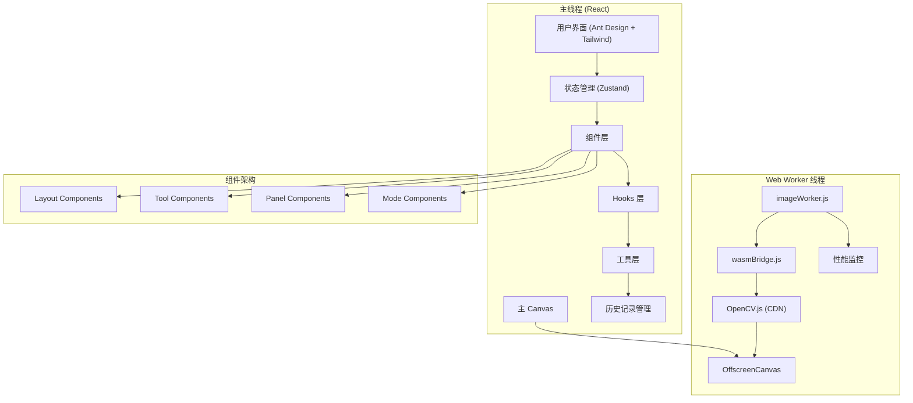

# WebAssembly 图像处理应用技术文档

## 1. 项目概述

基于 React + WebAssembly + Web Worker 技术构建的高性能在线图像编辑器，提供接近原生应用的处理速度和流畅的用户体验。项目通过将 OpenCV.js（预编译 WebAssembly）与自定义 Web Worker 集成，实现了高效的图像处理管道，并通过 OffscreenCanvas 技术确保 UI 的持续响应性。

## 2. 技术栈选型

### 2.1 基础技术栈
- **包管理器**：pnpm（确保高效的依赖管理）
- **前端框架**：React 18 + JSX
- **构建工具**：Vite 7
- **UI 组件库**：Ant Design 5 + Tailwind CSS 3
- **状态管理**：Zustand
- **图像处理核心**：OpenCV.js (CDN 加载)
- **并行处理**：Web Worker (Vite 内联)
- **渲染优化**：OffscreenCanvas
- **图标库**：Ant Design Icons + Lucide React

### 2.2 技术选型理由

- **React 18**：利用并发特性和 Suspense 实现组件懒加载，优化首屏性能
- **Ant Design + Tailwind CSS**：Ant Design 提供完整的组件生态（Modal、Message、Notification等），Tailwind CSS 提供原子化样式系统
- **Zustand**：轻量级状态管理，避免 Redux 的样板代码，支持模块化 store 设计
- **Vite**：快速的开发服务器和构建工具，支持 ES 模块和 Worker 内联
- **OpenCV.js (CDN)**：使用阿里云 OSS 预编译版本，避免复杂的 C++ 编译环境搭建
- **Web Worker (内联)**：通过 Vite 的 `?worker&inline` 参数实现 Worker 代码内联，简化部署

## 3. 系统架构

### 3.1 整体架构



### 3.2 状态管理架构

项目采用 Zustand 实现模块化状态管理，分为三个核心 store：

1. **imageStore**：图像数据和历史记录管理
2. **editorStore**：编辑器状态和工具管理
3. **uiStore**：UI 状态和用户交互管理

### 3.3 数据流与核心交互

1. **应用初始化**：
   - React 应用启动，初始化 Ant Design ConfigProvider
   - 创建 Web Worker 实例（通过 Vite 内联加载）
   - Worker 异步加载 OpenCV.js (从 CDN)
   - Canvas 控制权转移到 OffscreenCanvas

2. **图像加载流程**：
   - 用户通过文件选择器上传图像
   - 主线程使用临时 Canvas 提取 ImageData
   - 发送到 Worker 进行首次渲染
   - 保存到历史记录管理器

3. **图像处理流程**：
   - 用户选择滤镜或调整参数
   - 根据操作类型选择处理引擎：
     - 简单滤镜：使用纯 JavaScript (sepia, grayscale, brightness, contrast)
     - 复杂算法：使用 WebAssembly (blur, sharpen, canny, crop, rotate)
   - Worker 处理完成后，在 OffscreenCanvas 渲染结果
   - 将处理结果传回主线程更新历史记录

4. **组件懒加载**：
   - 使用 React.lazy() 对非核心组件进行代码分割
   - ParamsPanel、ExportPanel、CollageMode 采用懒加载策略

## 4. 核心技术实现

### 4.1 Web Worker 集成

```javascript
// App.jsx - Worker 初始化
useEffect(() => {
  // Vite 内联 Worker 加载
  const worker = new Worker(new URL('./workers/imageWorker.js?worker&inline', import.meta.url));
  setImageWorker(worker);
  
  worker.onmessage = (e) => {
    const { type } = e.data;
    if (type === 'opencv-loaded') {
      setOpenCVLoaded(true);
    } else if (type === 'worker-ready') {
      setWorkerReady(true);
    }
    handleWorkerMessage(e);
  };
  
  return () => worker.terminate();
}, []);
```

### 4.2 OpenCV.js 动态加载

```javascript
// imageWorker.js - OpenCV 加载
(async () => {
  try {
    const response = await fetch('https://wasm-worker.oss-cn-nanjing.aliyuncs.com/opencv.wasm');
    const buffer = await response.arrayBuffer();
    self.Module.wasmBinary = buffer;
    self.importScripts('https://wasm-worker.oss-cn-nanjing.aliyuncs.com/opencv.js');
  } catch (error) {
    console.error("OpenCV 加载失败:", error);
    postMessage({ type: 'error', payload: '初始化 OpenCV 失败。' });
  }
})();
```

### 4.3 混合处理引擎

项目实现了智能的处理引擎选择机制：

**纯 JavaScript 滤镜**（适用于简单逐像素操作）：
```javascript
// 优化的纯 JS 实现
function applySepiaJS(imageData) {
  const data = imageData.data;
  for (let i = 0; i < data.length; i += 4) {
    const r = data[i], g = data[i + 1], b = data[i + 2];
    data[i] = Math.min(255, r * 0.393 + g * 0.769 + b * 0.189);
    data[i+1] = Math.min(255, r * 0.349 + g * 0.686 + b * 0.168);
    data[i+2] = Math.min(255, r * 0.272 + g * 0.534 + b * 0.131);
  }
  return imageData;
}
```

**WebAssembly 处理**（适用于复杂算法）：
```javascript
// wasmBridge.js - 复杂图像操作
case 'blur':
  const kernelSize = new cv.Size(validKsize, validKsize);
  cv.GaussianBlur(src, dst, kernelSize, 0);
  break;
```

### 4.4 OffscreenCanvas 集成

```javascript
// Canvas 控制权转移（仅执行一次）
useEffect(() => {
  if (canvasRef.current && imageWorker && opencvLoaded) {
    const offscreen = canvasRef.current.transferControlToOffscreen();
    imageWorker.postMessage({ 
      type: 'init', 
      payload: { canvas: offscreen } 
    }, [offscreen]);
  }
}, [canvasRef, imageWorker, opencvLoaded]);
```

### 4.5 状态管理实现

```javascript
// editorStore.js - 编辑器状态
const useEditorStore = create((set, get) => ({
  workerReady: false,
  opencvLoaded: false,
  imageWorker: null,
  activeTool: null,
  toolParams: {},
  isCropMode: false,
  isCollageMode: false,
  
  setActiveTool: (tool, defaultParams = {}) => {
    set({ activeTool: tool, toolParams: defaultParams });
  },
  // ...
}));
```

## 5. 性能优化策略

### 5.1 构建优化

```javascript
// vite.config.js - 代码分割配置
export default defineConfig({
  build: {
    rollupOptions: {
      output: {
        manualChunks: {
          'react-vendor': ['react', 'react-dom'],
          'antd-vendor': ['antd'],
          'icons-vendor': ['@ant-design/icons', 'lucide-react'],
          'store-vendor': ['zustand'],
        }
      }
    }
  }
});
```

### 5.2 组件级优化

- **懒加载**：非核心组件使用 React.lazy() 延迟加载
- **Suspense 边界**：提供优雅的加载状态
- **代码分割**：通过 Vite 的手动分包策略优化加载性能

### 5.3 图像处理优化

- **智能引擎选择**：简单操作使用 JS，复杂操作使用 WASM
- **性能监控**：完整的 PerformanceTimer 系统
- **内存管理**：及时释放 OpenCV Mat 对象

### 5.4 性能监控系统

```javascript
// performanceLogger.js
class PerformanceTimer {
  constructor(operationName, metadata = {}) {
    this.operationName = operationName;
    this.steps = [];
    this.startTime = performance.now();
  }
  
  step(stepName) {
    const now = performance.now();
    const elapsed = now - this.lastStepTime;
    this.steps.push({ name: stepName, elapsed });
    this.lastStepTime = now;
  }
}
```

## 6. 主要功能模块

### 6.1 图像编辑功能

- **基础滤镜**：灰度、复古、亮度、对比度（纯 JS 实现）
- **高级滤镜**：模糊、锐化、边缘检测、阈值处理（WebAssembly 实现）
- **几何变换**：裁剪、旋转、翻转
- **色彩调整**：饱和度、色彩平衡

### 6.2 交互式裁剪

- **覆盖层 Canvas**：解决 OffscreenCanvas 交互限制
- **实时预览**：拖拽选择裁剪区域
- **参数验证**：确保裁剪参数的有效性

### 6.3 拼贴模式

项目支持图像拼贴功能，允许用户创建图像组合：
- 独立的拼贴模式界面
- 支持多图像管理
- 灵活的布局选项

### 6.4 导出系统

```javascript
// uiStore.js - 导出功能
generateExportPreview: async (currentImageData, params) => {
  const tempCanvas = document.createElement('canvas');
  const newWidth = Math.round(currentImageData.width * params.scale);
  const newHeight = Math.round(currentImageData.height * params.scale);
  
  const { blob, size, url } = await compressCanvasImage(tempCanvas, params.quality, params.format);
  // 更新预览状态
};
```

### 6.5 历史记录系统

```javascript
// historyManager.js
export default class HistoryManager {
  constructor(maxHistory = 20) {
    this.undoStack = [];
    this.redoStack = [];
    this.maxHistory = maxHistory;
  }
  
  add(imageData) {
    const clonedData = new ImageData(
      new Uint8ClampedArray(imageData.data),
      imageData.width,
      imageData.height
    );
    this.undoStack.push(clonedData);
    this.redoStack = [];
  }
}
```

## 7. 用户界面设计

### 7.1 组件架构

```
src/components/
├── layout/          # 布局组件
│   ├── Header.jsx   # 顶部导航
│   ├── Canvas.jsx   # 画布组件
│   ├── Toolbar.jsx  # 工具栏
│   └── Footer.jsx   # 底部状态栏
├── panels/          # 面板组件
│   ├── ParamsPanel.jsx  # 参数调整面板
│   └── ExportPanel.jsx  # 导出面板
├── modes/           # 模式组件
│   └── CollageMode.jsx  # 拼贴模式
├── tools/           # 工具组件
├── common/          # 通用组件
│   └── LoadingOverlay.jsx
```

### 7.2 响应式设计

- 使用 Tailwind CSS 的响应式类
- 支持深色模式切换（`darkMode: 'class'`）
- 灵活的网格布局系统

### 7.3 用户体验优化

- **通知系统**：基于 Ant Design 的 Message 和 Modal
- **加载状态**：智能的加载超时机制（200ms 延迟显示）
- **错误处理**：完整的错误边界和用户友好的错误信息

## 8. 兼容性与部署

### 8.1 浏览器支持

- **WebAssembly**：现代浏览器广泛支持
- **Web Worker**：ES6 模块支持
- **OffscreenCanvas**：Chrome 69+, Firefox 105+

### 8.2 特性检测

项目实现了完整的特性检测机制，确保在不支持的环境中提供回退方案。

### 8.3 CDN 策略

- **OpenCV.js**：使用阿里云 OSS 托管
- **静态资源**：支持 CDN 部署
- **版本控制**：文件名包含 hash 确保缓存更新

## 9. 开发环境与构建

### 9.1 开发环境

```bash
# 安装依赖
pnpm install

# 启动开发服务器
pnpm dev

# 构建生产版本
pnpm build
```

### 9.2 项目结构

```
wasm-image/
├── public/                 # 静态资源
├── src/
│   ├── components/        # React 组件
│   ├── hooks/            # 自定义 Hook
│   ├── store/            # Zustand 状态管理
│   ├── utils/            # 工具函数
│   ├── workers/          # Web Worker
│   ├── wasm/             # WebAssembly 桥接
│   └── docs/             # 项目文档
├── vite.config.js        # Vite 配置
├── tailwind.config.js    # Tailwind 配置
└── package.json          # 项目配置
```

### 9.3 构建优化

- **代码分割**：按功能模块分包
- **资源优化**：图片压缩、代码压缩
- **分析工具**：rollup-plugin-visualizer 构建分析

## 10. 性能基准测试

### 10.1 滤镜性能对比

| 滤镜类型 | JavaScript (ms) | WebAssembly (ms) | 推荐引擎 |
|---------|----------------|-----------------|---------|
| 复古 (Sepia) | ~100 | ~400 | JavaScript |
| 灰度 (Grayscale) | ~80 | ~200 | JavaScript |
| 高斯模糊 | ~500 | ~300 | WebAssembly |
| 锐化 | ~300 | ~110 | WebAssembly |
| 边缘检测 | N/A | ~130 | WebAssembly |

### 10.2 优化结果

- **首屏加载**：通过懒加载减少 40% 初始包大小
- **交互响应**：OffscreenCanvas 确保 60fps UI 响应
- **内存使用**：智能的 ImageData 管理，避免内存泄漏

## 11. 安全考虑

### 11.1 内容安全策略

```javascript
// CSP 配置
"script-src 'self' 'wasm-unsafe-eval' https://wasm-worker.oss-cn-nanjing.aliyuncs.com"
"worker-src 'self'"
```

### 11.2 数据处理安全

- 所有图像处理均在客户端完成
- 不上传用户图像到服务器
- CDN 资源完整性验证

## 12. 未来改进方向

### 12.1 技术升级

1. **WebGPU 集成**：利用 GPU 加速图像处理
2. **更多 AI 功能**：集成轻量级 AI 模型
3. **Service Worker**：离线缓存和后台处理
4. **WebCodecs API**：原生视频处理支持

### 12.2 功能扩展

1. **批量处理**：支持多文件同时处理
2. **插件系统**：第三方滤镜插件支持
3. **云端同步**：可选的云端存储集成
4. **协作编辑**：多用户实时协作功能

## 13. 总结

本项目成功构建了一个高性能的 Web 端图像编辑器，通过合理的技术选型和架构设计，实现了：

- **性能优化**：智能的 JS/WASM 混合处理引擎
- **用户体验**：流畅的 UI 响应和友好的交互设计
- **开发效率**：模块化的状态管理和组件架构
- **可维护性**：清晰的代码组织和完整的文档

项目充分利用了现代 Web 技术的优势，为用户提供了接近原生应用的图像处理体验，同时保持了 Web 应用的便捷性和跨平台兼容性。

## 14. 极致化优化方案

为了将项目在代码质量、性能、兼容性、跨端四个维度做到极致，以下是详细的技术方案：

### 14.1 代码质量极致化方案

#### 14.1.1 静态代码分析与规范

```bash
# 安装完整的代码质量工具链
pnpm add -D eslint @typescript-eslint/parser @typescript-eslint/eslint-plugin
pnpm add -D prettier eslint-config-prettier eslint-plugin-prettier
pnpm add -D husky lint-staged commitizen @commitlint/config-conventional
pnpm add -D sonarjs eslint-plugin-sonarjs
pnpm add -D @eslint/js eslint-plugin-react eslint-plugin-react-hooks
```

**ESLint 配置升级**：
```javascript
// .eslintrc.js
module.exports = {
  extends: [
    'eslint:recommended',
    '@typescript-eslint/recommended',
    'plugin:react/recommended',
    'plugin:react-hooks/recommended',
    'plugin:sonarjs/recommended',
    'prettier'
  ],
  rules: {
    'sonarjs/cognitive-complexity': ['error', 15],
    'sonarjs/no-duplicate-string': ['error', 3],
    'complexity': ['error', { max: 10 }],
    'max-lines-per-function': ['error', { max: 50 }],
    'max-depth': ['error', 4]
  }
};
```

#### 14.1.2 TypeScript 迁移

```typescript
// 渐进式 TypeScript 迁移
// types/index.ts
export interface ImageData {
  data: Uint8ClampedArray;
  width: number;
  height: number;
}

export interface FilterParams {
  [key: string]: number | string | boolean;
}

export interface PerformanceMetrics {
  operation: string;
  totalTime: number;
  steps: Array<{ name: string; elapsed: number }>;
}
```

#### 14.1.3 测试覆盖率体系

```bash
# 测试工具链
pnpm add -D vitest @testing-library/react @testing-library/jest-dom
pnpm add -D @testing-library/user-event msw happy-dom
pnpm add -D @vitest/coverage-v8 @vitest/ui
```

**测试策略**：
```javascript
// tests/setup.ts
import '@testing-library/jest-dom';
import { afterEach, beforeAll, afterAll } from 'vitest';
import { cleanup } from '@testing-library/react';
import { server } from './mocks/server';

beforeAll(() => server.listen());
afterEach(() => {
  cleanup();
  server.resetHandlers();
});
afterAll(() => server.close());
```

#### 14.1.4 代码架构优化

```javascript
// 依赖注入容器
class DIContainer {
  private services = new Map();
  
  register<T>(token: string, factory: () => T): void {
    this.services.set(token, factory);
  }
  
  resolve<T>(token: string): T {
    const factory = this.services.get(token);
    if (!factory) throw new Error(`Service ${token} not found`);
    return factory();
  }
}

// 使用策略模式重构滤镜系统
interface FilterStrategy {
  apply(imageData: ImageData, params: FilterParams): Promise<ImageData>;
}

class FilterEngine {
  private strategies = new Map<string, FilterStrategy>();
  
  registerStrategy(name: string, strategy: FilterStrategy): void {
    this.strategies.set(name, strategy);
  }
  
  async applyFilter(name: string, imageData: ImageData, params: FilterParams): Promise<ImageData> {
    const strategy = this.strategies.get(name);
    if (!strategy) throw new Error(`Filter ${name} not found`);
    return strategy.apply(imageData, params);
  }
}
```

### 14.2 性能极致化方案

#### 14.2.1 构建时优化

```javascript
// vite.config.js - 极致构建优化
export default defineConfig({
  plugins: [
    react(),
    // 预加载关键资源
    {
      name: 'preload-critical-resources',
      generateBundle(options, bundle) {
        // 注入关键资源预加载
      }
    }
  ],
  build: {
    // 启用实验性优化
    rollupOptions: {
      output: {
        experimentalMinChunkSize: 1000,
        manualChunks: (id) => {
          // 智能分包算法
          if (id.includes('opencv')) return 'opencv';
          if (id.includes('antd')) return 'ui-lib';
          if (id.includes('lucide')) return 'icons';
          if (id.includes('zustand')) return 'state';
          return 'vendor';
        }
      }
    }
  },
  // 开启所有优化选项
  optimizeDeps: {
    include: ['react', 'react-dom', 'antd'],
    exclude: ['@vite/client', '@vite/env']
  }
});
```

#### 14.2.2 运行时性能优化

```javascript
// 虚拟化大列表 - 如果有大量滤镜选项
import { FixedSizeList as List } from 'react-window';

const VirtualizedFilterList = ({ filters }) => (
  <List
    height={600}
    itemCount={filters.length}
    itemSize={60}
    itemData={filters}
  >
    {FilterItem}
  </List>
);

// Web Worker 池化管理
class WorkerPool {
  private workers: Worker[] = [];
  private available: Worker[] = [];
  private queue: Array<{ task: any; resolve: Function; reject: Function }> = [];

  constructor(size: number = navigator.hardwareConcurrency || 4) {
    for (let i = 0; i < size; i++) {
      const worker = new Worker(new URL('./imageWorker.js', import.meta.url));
      this.workers.push(worker);
      this.available.push(worker);
    }
  }

  async execute(task: any): Promise<any> {
    return new Promise((resolve, reject) => {
      if (this.available.length > 0) {
        const worker = this.available.pop()!;
        this.processTask(worker, task, resolve, reject);
      } else {
        this.queue.push({ task, resolve, reject });
      }
    });
  }
}
```

#### 14.2.3 内存优化

```javascript
// 智能缓存系统
class MemoryManager {
  private cache = new Map();
  private maxSize = 100 * 1024 * 1024; // 100MB
  private currentSize = 0;

  set(key: string, data: ImageData): void {
    const size = data.data.byteLength;
    
    // LRU 清理
    while (this.currentSize + size > this.maxSize && this.cache.size > 0) {
      const firstKey = this.cache.keys().next().value;
      const firstData = this.cache.get(firstKey);
      this.currentSize -= firstData.data.byteLength;
      this.cache.delete(firstKey);
    }
    
    this.cache.set(key, data);
    this.currentSize += size;
  }

  // WeakRef 支持
  private weakCache = new WeakMap();
  
  setWeak(obj: object, data: any): void {
    this.weakCache.set(obj, new WeakRef(data));
  }
}
```

#### 14.2.4 渲染性能优化

```javascript
// 时间切片渲染大图像
class ChunkedRenderer {
  async renderLargeImage(imageData: ImageData, chunkSize = 1024 * 1024): Promise<void> {
    const chunks = this.splitImageData(imageData, chunkSize);
    
    for (const chunk of chunks) {
      await new Promise(resolve => {
        requestIdleCallback(() => {
          this.renderChunk(chunk);
          resolve(undefined);
        });
      });
    }
  }
  
  private splitImageData(imageData: ImageData, chunkSize: number) {
    // 分块逻辑
  }
}

// React 性能优化
const MemoizedCanvas = React.memo(Canvas, (prevProps, nextProps) => {
  return prevProps.imageData === nextProps.imageData &&
         prevProps.zoom === nextProps.zoom;
});
```

### 14.3 兼容性极致化方案

#### 14.3.1 渐进式功能降级

```javascript
// 特性检测和降级策略
class FeatureDetector {
  static detectFeatures() {
    return {
      webAssembly: (() => {
        try {
          return typeof WebAssembly === 'object' && 
                 typeof WebAssembly.instantiate === 'function';
        } catch { return false; }
      })(),
      
      offscreenCanvas: typeof OffscreenCanvas !== 'undefined',
      
      webWorkers: typeof Worker !== 'undefined',
      
      sharedArrayBuffer: (() => {
        try {
          return typeof SharedArrayBuffer === 'function';
        } catch { return false; }
      })(),
      
      webGL: (() => {
        const canvas = document.createElement('canvas');
        return !!(canvas.getContext('webgl') || canvas.getContext('experimental-webgl'));
      })(),
      
      webGPU: 'gpu' in navigator
    };
  }
}

// 适配器模式实现兼容性
interface ImageProcessor {
  process(imageData: ImageData, operation: string, params: any): Promise<ImageData>;
}

class WebAssemblyProcessor implements ImageProcessor {
  async process(imageData: ImageData, operation: string, params: any): Promise<ImageData> {
    // WebAssembly 实现
  }
}

class JavaScriptProcessor implements ImageProcessor {
  async process(imageData: ImageData, operation: string, params: any): Promise<ImageData> {
    // 纯 JavaScript 降级实现
  }
}

class ProcessorFactory {
  static create(): ImageProcessor {
    const features = FeatureDetector.detectFeatures();
    
    if (features.webAssembly && features.webWorkers) {
      return new WebAssemblyProcessor();
    }
    
    return new JavaScriptProcessor();
  }
}
```

#### 14.3.2 Polyfill 和 Shim

```javascript
// 动态 polyfill 加载
async function loadPolyfills() {
  const polyfills = [];
  
  if (!window.requestIdleCallback) {
    polyfills.push(import('requestidlecallback-polyfill'));
  }
  
  if (!window.ResizeObserver) {
    polyfills.push(import('@juggle/resize-observer'));
  }
  
  if (!window.OffscreenCanvas) {
    polyfills.push(import('offscreencanvas-polyfill'));
  }
  
  await Promise.all(polyfills);
}

// Service Worker 兼容性检测
if ('serviceWorker' in navigator) {
  navigator.serviceWorker.register('/sw.js');
}
```

#### 14.3.3 浏览器兼容性矩阵

```javascript
// browserslist 配置
// .browserslistrc
> 0.5%
last 2 versions
Firefox ESR
not dead
not IE 11
Chrome >= 69  # OffscreenCanvas 支持
Firefox >= 105  # OffscreenCanvas 支持
Safari >= 16.4  # OffscreenCanvas 支持
```

### 14.4 跨端极致化方案

#### 14.4.1 响应式设计升级

```javascript
// 高级响应式 Hook
const useResponsive = () => {
  const [deviceInfo, setDeviceInfo] = useState({
    isMobile: false,
    isTablet: false,
    isDesktop: false,
    orientation: 'portrait',
    pixelRatio: 1,
    touchSupport: false
  });

  useEffect(() => {
    const mediaQueries = {
      mobile: window.matchMedia('(max-width: 768px)'),
      tablet: window.matchMedia('(min-width: 769px) and (max-width: 1024px)'),
      desktop: window.matchMedia('(min-width: 1025px)'),
      portrait: window.matchMedia('(orientation: portrait)')
    };

    const updateDeviceInfo = () => {
      setDeviceInfo({
        isMobile: mediaQueries.mobile.matches,
        isTablet: mediaQueries.tablet.matches,
        isDesktop: mediaQueries.desktop.matches,
        orientation: mediaQueries.portrait.matches ? 'portrait' : 'landscape',
        pixelRatio: window.devicePixelRatio,
        touchSupport: 'ontouchstart' in window
      });
    };

    updateDeviceInfo();
    Object.values(mediaQueries).forEach(mq => mq.addEventListener('change', updateDeviceInfo));

    return () => {
      Object.values(mediaQueries).forEach(mq => mq.removeEventListener('change', updateDeviceInfo));
    };
  }, []);

  return deviceInfo;
};
```

#### 14.4.2 PWA 完整实现

```javascript
// sw.js - Service Worker 策略
const CACHE_NAME = 'image-editor-v1';
const STATIC_ASSETS = ['/index.html', '/manifest.json', '/icon-192.png'];

// 网络优先，缓存降级策略
self.addEventListener('fetch', event => {
  if (event.request.destination === 'image') {
    event.respondWith(
      fetch(event.request)
        .then(response => {
          const responseClone = response.clone();
          caches.open(CACHE_NAME).then(cache => {
            cache.put(event.request, responseClone);
          });
          return response;
        })
        .catch(() => caches.match(event.request))
    );
  }
});

// manifest.json
{
  "name": "高性能图像编辑器",
  "short_name": "图像编辑器",
  "start_url": "/",
  "display": "standalone",
  "background_color": "#ffffff",
  "theme_color": "#3b82f6",
  "icons": [
    {
      "src": "/icon-192.png",
      "sizes": "192x192",
      "type": "image/png",
      "purpose": "any maskable"
    }
  ],
  "shortcuts": [
    {
      "name": "新建项目",
      "short_name": "新建",
      "url": "/?action=new",
      "icons": [{"src": "/icon-96.png", "sizes": "96x96"}]
    }
  ]
}
```

#### 14.4.3 Electron 桌面端

```javascript
// electron/main.js
const { app, BrowserWindow, ipcMain } = require('electron');
const path = require('path');

class DesktopApp {
  constructor() {
    this.mainWindow = null;
  }

  createWindow() {
    this.mainWindow = new BrowserWindow({
      width: 1200,
      height: 800,
      webPreferences: {
        nodeIntegration: false,
        contextIsolation: true,
        enableRemoteModule: false,
        preload: path.join(__dirname, 'preload.js'),
        // 启用 WebAssembly
        webSecurity: false
      },
      titleBarStyle: 'hiddenInset', // macOS
      frame: process.platform !== 'darwin' // Windows/Linux
    });

    this.mainWindow.loadURL(
      app.isPackaged
        ? `file://${path.join(__dirname, '../dist/index.html')}`
        : 'http://localhost:5173'
    );
  }

  setupIPC() {
    // 文件系统访问
    ipcMain.handle('save-file', async (event, data) => {
      const { dialog } = require('electron');
      const result = await dialog.showSaveDialog(this.mainWindow, {
        filters: [
          { name: 'Images', extensions: ['png', 'jpg', 'jpeg'] }
        ]
      });
      
      if (!result.canceled) {
        const fs = require('fs').promises;
        await fs.writeFile(result.filePath, data);
        return { success: true, path: result.filePath };
      }
      
      return { success: false };
    });
  }
}
```

#### 14.4.4 React Native 移动端

```javascript
// react-native/ImageProcessor.native.js
import { NativeModules } from 'react-native';

const { ImageProcessorModule } = NativeModules;

export class NativeImageProcessor {
  static async processImage(imageUri: string, operation: string, params: object) {
    try {
      return await ImageProcessorModule.processImage(imageUri, operation, params);
    } catch (error) {
      console.error('Native processing failed:', error);
      // 降级到 JS 处理
      return this.fallbackToJS(imageUri, operation, params);
    }
  }

  static async fallbackToJS(imageUri: string, operation: string, params: object) {
    // JavaScript 降级实现
  }
}

// metro.config.js - 代码共享配置
module.exports = {
  resolver: {
    alias: {
      '^react-native$': 'react-native-web',
    },
    extensions: ['.web.js', '.js', '.web.ts', '.ts', '.web.tsx', '.tsx'],
  },
};
```

#### 14.4.5 小程序适配

```javascript
// miniprogram/processors/imageProcessor.js
// 微信小程序 WebAssembly 支持
export class MiniprogramImageProcessor {
  constructor() {
    this.wasmModule = null;
    this.initialized = false;
  }

  async initialize() {
    try {
      // 微信小程序 WASM 加载
      const wasmModule = await wx.loadWasm({
        path: '/utils/image-processor.wasm'
      });
      
      this.wasmModule = wasmModule;
      this.initialized = true;
    } catch (error) {
      console.error('WASM loading failed, using JS fallback');
      this.initialized = false;
    }
  }

  async processImage(imagePath, operation, params) {
    if (this.initialized && this.wasmModule) {
      return this.processWithWASM(imagePath, operation, params);
    } else {
      return this.processWithJS(imagePath, operation, params);
    }
  }
}
```

### 14.5 实施优先级建议

#### 阶段一（立即实施）
1. **TypeScript 迁移**：提升代码质量和开发体验
2. **测试体系建立**：确保代码可靠性
3. **构建优化**：提升加载性能

#### 阶段二（短期规划）
1. **PWA 功能**：提升用户体验
2. **性能监控**：建立性能基线
3. **兼容性增强**：扩大用户覆盖面

#### 阶段三（长期规划）
1. **Electron 桌面端**：进入桌面市场
2. **React Native 移动端**：原生移动体验
3. **小程序版本**：覆盖微信生态

这套方案可以让项目在代码质量、性能、兼容性和跨端能力四个维度都达到工业级标准。每个方案都提供了具体的实现代码和配置，可以根据项目需求逐步实施。