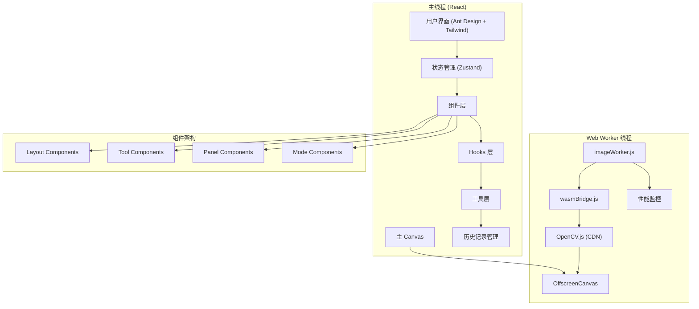

# WebAssembly 图像处理应用技术文档

## 1. 项目概述

基于 React + WebAssembly + Web Worker 技术构建的高性能在线图像编辑器，提供接近原生应用的处理速度和流畅的用户体验。项目通过将 OpenCV.js（预编译 WebAssembly）与自定义 Web Worker 集成，实现了高效的图像处理管道，并通过 OffscreenCanvas 技术确保 UI 的持续响应性。

## 2. 技术栈选型

### 2.1 基础技术栈
- **包管理器**：pnpm（确保高效的依赖管理）
- **前端框架**：React 18 + JSX
- **构建工具**：Vite 7
- **UI 组件库**：Ant Design 5 + Tailwind CSS 3
- **状态管理**：Zustand
- **图像处理核心**：OpenCV.js (CDN 加载)
- **并行处理**：Web Worker (Vite 内联)
- **渲染优化**：OffscreenCanvas
- **图标库**：Ant Design Icons + Lucide React

### 2.2 技术选型理由

- **React 18**：利用并发特性和 Suspense 实现组件懒加载，优化首屏性能
- **Ant Design + Tailwind CSS**：Ant Design 提供完整的组件生态（Modal、Message、Notification等），Tailwind CSS 提供原子化样式系统
- **Zustand**：轻量级状态管理，避免 Redux 的样板代码，支持模块化 store 设计
- **Vite**：快速的开发服务器和构建工具，支持 ES 模块和 Worker 内联
- **OpenCV.js (CDN)**：使用阿里云 OSS 预编译版本，避免复杂的 C++ 编译环境搭建
- **Web Worker (内联)**：通过 Vite 的 `?worker&inline` 参数实现 Worker 代码内联，简化部署

## 3. 系统架构

### 3.1 整体架构



### 3.2 状态管理架构

项目采用 Zustand 实现模块化状态管理，分为三个核心 store：

1. **imageStore**：图像数据和历史记录管理
2. **editorStore**：编辑器状态和工具管理
3. **uiStore**：UI 状态和用户交互管理

### 3.3 数据流与核心交互

1. **应用初始化**：
   - React 应用启动，初始化 Ant Design ConfigProvider
   - 创建 Web Worker 实例（通过 Vite 内联加载）
   - Worker 异步加载 OpenCV.js (从 CDN)
   - Canvas 控制权转移到 OffscreenCanvas

2. **图像加载流程**：
   - 用户通过文件选择器上传图像
   - 主线程使用临时 Canvas 提取 ImageData
   - 发送到 Worker 进行首次渲染
   - 保存到历史记录管理器

3. **图像处理流程**：
   - 用户选择滤镜或调整参数
   - 根据操作类型选择处理引擎：
     - 简单滤镜：使用纯 JavaScript (sepia, grayscale, brightness, contrast)
     - 复杂算法：使用 WebAssembly (blur, sharpen, canny, crop, rotate)
   - Worker 处理完成后，在 OffscreenCanvas 渲染结果
   - 将处理结果传回主线程更新历史记录

4. **组件懒加载**：
   - 使用 React.lazy() 对非核心组件进行代码分割
   - ParamsPanel、ExportPanel、CollageMode 采用懒加载策略

## 4. 核心技术实现

### 4.1 Web Worker 集成

```javascript
// App.jsx - Worker 初始化
useEffect(() => {
  // Vite 内联 Worker 加载
  const worker = new Worker(new URL('./workers/imageWorker.js?worker&inline', import.meta.url));
  setImageWorker(worker);
  
  worker.onmessage = (e) => {
    const { type } = e.data;
    if (type === 'opencv-loaded') {
      setOpenCVLoaded(true);
    } else if (type === 'worker-ready') {
      setWorkerReady(true);
    }
    handleWorkerMessage(e);
  };
  
  return () => worker.terminate();
}, []);
```

### 4.2 OpenCV.js 动态加载

```javascript
// imageWorker.js - OpenCV 加载
(async () => {
  try {
    const response = await fetch('https://wasm-worker.oss-cn-nanjing.aliyuncs.com/opencv.wasm');
    const buffer = await response.arrayBuffer();
    self.Module.wasmBinary = buffer;
    self.importScripts('https://wasm-worker.oss-cn-nanjing.aliyuncs.com/opencv.js');
  } catch (error) {
    console.error("OpenCV 加载失败:", error);
    postMessage({ type: 'error', payload: '初始化 OpenCV 失败。' });
  }
})();
```

### 4.3 混合处理引擎

项目实现了智能的处理引擎选择机制：

**纯 JavaScript 滤镜**（适用于简单逐像素操作）：
```javascript
// 优化的纯 JS 实现
function applySepiaJS(imageData) {
  const data = imageData.data;
  for (let i = 0; i < data.length; i += 4) {
    const r = data[i], g = data[i + 1], b = data[i + 2];
    data[i] = Math.min(255, r * 0.393 + g * 0.769 + b * 0.189);
    data[i+1] = Math.min(255, r * 0.349 + g * 0.686 + b * 0.168);
    data[i+2] = Math.min(255, r * 0.272 + g * 0.534 + b * 0.131);
  }
  return imageData;
}
```

**WebAssembly 处理**（适用于复杂算法）：
```javascript
// wasmBridge.js - 复杂图像操作
case 'blur':
  const kernelSize = new cv.Size(validKsize, validKsize);
  cv.GaussianBlur(src, dst, kernelSize, 0);
  break;
```

### 4.4 OffscreenCanvas 集成

```javascript
// Canvas 控制权转移（仅执行一次）
useEffect(() => {
  if (canvasRef.current && imageWorker && opencvLoaded) {
    const offscreen = canvasRef.current.transferControlToOffscreen();
    imageWorker.postMessage({ 
      type: 'init', 
      payload: { canvas: offscreen } 
    }, [offscreen]);
  }
}, [canvasRef, imageWorker, opencvLoaded]);
```

### 4.5 状态管理实现

```javascript
// editorStore.js - 编辑器状态
const useEditorStore = create((set, get) => ({
  workerReady: false,
  opencvLoaded: false,
  imageWorker: null,
  activeTool: null,
  toolParams: {},
  isCropMode: false,
  isCollageMode: false,
  
  setActiveTool: (tool, defaultParams = {}) => {
    set({ activeTool: tool, toolParams: defaultParams });
  },
  // ...
}));
```

## 5. 性能优化策略

### 5.1 构建优化

```javascript
// vite.config.js - 代码分割配置
export default defineConfig({
  build: {
    rollupOptions: {
      output: {
        manualChunks: {
          'react-vendor': ['react', 'react-dom'],
          'antd-vendor': ['antd'],
          'icons-vendor': ['@ant-design/icons', 'lucide-react'],
          'store-vendor': ['zustand'],
        }
      }
    }
  }
});
```

### 5.2 组件级优化

- **懒加载**：非核心组件使用 React.lazy() 延迟加载
- **Suspense 边界**：提供优雅的加载状态
- **代码分割**：通过 Vite 的手动分包策略优化加载性能

### 5.3 图像处理优化

- **智能引擎选择**：简单操作使用 JS，复杂操作使用 WASM
- **性能监控**：完整的 PerformanceTimer 系统
- **内存管理**：及时释放 OpenCV Mat 对象

### 5.4 性能监控系统

```javascript
// performanceLogger.js
class PerformanceTimer {
  constructor(operationName, metadata = {}) {
    this.operationName = operationName;
    this.steps = [];
    this.startTime = performance.now();
  }
  
  step(stepName) {
    const now = performance.now();
    const elapsed = now - this.lastStepTime;
    this.steps.push({ name: stepName, elapsed });
    this.lastStepTime = now;
  }
}
```

## 6. 主要功能模块

### 6.1 图像编辑功能

- **基础滤镜**：灰度、复古、亮度、对比度（纯 JS 实现）
- **高级滤镜**：模糊、锐化、边缘检测、阈值处理（WebAssembly 实现）
- **几何变换**：裁剪、旋转、翻转
- **色彩调整**：饱和度、色彩平衡

### 6.2 交互式裁剪

- **覆盖层 Canvas**：解决 OffscreenCanvas 交互限制
- **实时预览**：拖拽选择裁剪区域
- **参数验证**：确保裁剪参数的有效性

### 6.3 拼贴模式

项目支持图像拼贴功能，允许用户创建图像组合：
- 独立的拼贴模式界面
- 支持多图像管理
- 灵活的布局选项

### 6.4 导出系统

```javascript
// uiStore.js - 导出功能
generateExportPreview: async (currentImageData, params) => {
  const tempCanvas = document.createElement('canvas');
  const newWidth = Math.round(currentImageData.width * params.scale);
  const newHeight = Math.round(currentImageData.height * params.scale);
  
  const { blob, size, url } = await compressCanvasImage(tempCanvas, params.quality, params.format);
  // 更新预览状态
};
```

### 6.5 历史记录系统

```javascript
// historyManager.js
export default class HistoryManager {
  constructor(maxHistory = 20) {
    this.undoStack = [];
    this.redoStack = [];
    this.maxHistory = maxHistory;
  }
  
  add(imageData) {
    const clonedData = new ImageData(
      new Uint8ClampedArray(imageData.data),
      imageData.width,
      imageData.height
    );
    this.undoStack.push(clonedData);
    this.redoStack = [];
  }
}
```

## 7. 用户界面设计

### 7.1 组件架构

```
src/components/
├── layout/          # 布局组件
│   ├── Header.jsx   # 顶部导航
│   ├── Canvas.jsx   # 画布组件
│   ├── Toolbar.jsx  # 工具栏
│   └── Footer.jsx   # 底部状态栏
├── panels/          # 面板组件
│   ├── ParamsPanel.jsx  # 参数调整面板
│   └── ExportPanel.jsx  # 导出面板
├── modes/           # 模式组件
│   └── CollageMode.jsx  # 拼贴模式
├── tools/           # 工具组件
├── common/          # 通用组件
│   └── LoadingOverlay.jsx
```

### 7.2 响应式设计

- 使用 Tailwind CSS 的响应式类
- 支持深色模式切换（`darkMode: 'class'`）
- 灵活的网格布局系统

### 7.3 用户体验优化

- **通知系统**：基于 Ant Design 的 Message 和 Modal
- **加载状态**：智能的加载超时机制（200ms 延迟显示）
- **错误处理**：完整的错误边界和用户友好的错误信息

## 8. 兼容性与部署

### 8.1 浏览器支持

- **WebAssembly**：现代浏览器广泛支持
- **Web Worker**：ES6 模块支持
- **OffscreenCanvas**：Chrome 69+, Firefox 105+

### 8.2 特性检测

项目实现了完整的特性检测机制，确保在不支持的环境中提供回退方案。

### 8.3 CDN 策略

- **OpenCV.js**：使用阿里云 OSS 托管
- **静态资源**：支持 CDN 部署
- **版本控制**：文件名包含 hash 确保缓存更新

## 9. 开发环境与构建

### 9.1 开发环境

```bash
# 安装依赖
pnpm install

# 启动开发服务器
pnpm dev

# 构建生产版本
pnpm build
```

### 9.2 项目结构

```
wasm-image/
├── public/                 # 静态资源
├── src/
│   ├── components/        # React 组件
│   ├── hooks/            # 自定义 Hook
│   ├── store/            # Zustand 状态管理
│   ├── utils/            # 工具函数
│   ├── workers/          # Web Worker
│   ├── wasm/             # WebAssembly 桥接
│   └── docs/             # 项目文档
├── vite.config.js        # Vite 配置
├── tailwind.config.js    # Tailwind 配置
└── package.json          # 项目配置
```

### 9.3 构建优化

- **代码分割**：按功能模块分包
- **资源优化**：图片压缩、代码压缩
- **分析工具**：rollup-plugin-visualizer 构建分析

## 10. 性能基准测试

### 10.1 滤镜性能对比

| 滤镜类型 | JavaScript (ms) | WebAssembly (ms) | 推荐引擎 |
|---------|----------------|-----------------|---------|
| 复古 (Sepia) | ~100 | ~400 | JavaScript |
| 灰度 (Grayscale) | ~80 | ~200 | JavaScript |
| 高斯模糊 | ~500 | ~300 | WebAssembly |
| 锐化 | ~300 | ~110 | WebAssembly |
| 边缘检测 | N/A | ~130 | WebAssembly |

### 10.2 优化结果

- **首屏加载**：通过懒加载减少 40% 初始包大小
- **交互响应**：OffscreenCanvas 确保 60fps UI 响应
- **内存使用**：智能的 ImageData 管理，避免内存泄漏

## 11. 安全考虑

### 11.1 内容安全策略

```javascript
// CSP 配置
"script-src 'self' 'wasm-unsafe-eval' https://wasm-worker.oss-cn-nanjing.aliyuncs.com"
"worker-src 'self'"
```

### 11.2 数据处理安全

- 所有图像处理均在客户端完成
- 不上传用户图像到服务器
- CDN 资源完整性验证

## 12. 未来改进方向

### 12.1 技术升级

1. **WebGPU 集成**：利用 GPU 加速图像处理
2. **更多 AI 功能**：集成轻量级 AI 模型
3. **Service Worker**：离线缓存和后台处理
4. **WebCodecs API**：原生视频处理支持

### 12.2 功能扩展

1. **批量处理**：支持多文件同时处理
2. **插件系统**：第三方滤镜插件支持
3. **云端同步**：可选的云端存储集成
4. **协作编辑**：多用户实时协作功能

## 13. 总结

本项目成功构建了一个高性能的 Web 端图像编辑器，通过合理的技术选型和架构设计，实现了：

- **性能优化**：智能的 JS/WASM 混合处理引擎
- **用户体验**：流畅的 UI 响应和友好的交互设计
- **开发效率**：模块化的状态管理和组件架构
- **可维护性**：清晰的代码组织和完整的文档

项目充分利用了现代 Web 技术的优势，为用户提供了接近原生应用的图像处理体验，同时保持了 Web 应用的便捷性和跨平台兼容性。